# TiviGame — Socket Event Flow Documentation

> **Last updated:** 2026-03-03  
> **Scope:** Server · TV Client · Mobile Client

---

## 1. System Architecture

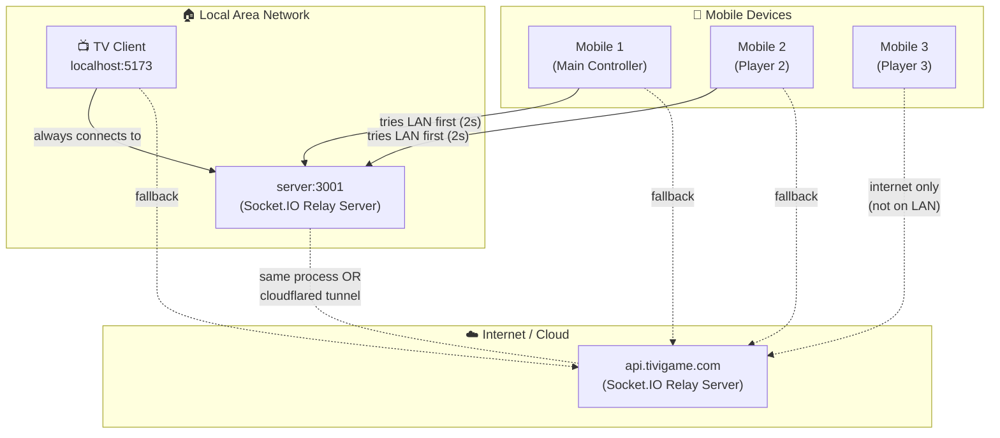

**Key architectural rules:**
- **TV is always the source of truth.** It owns all game logic and state.
- **Server only relays.** It stores minimal state (enough to sync a reconnecting mobile) and forwards messages.
- **Mobile only sends inputs.** It re-renders UI based on what the TV broadcasts — no local game logic.

---

## 2. Dual Transport — LAN vs Internet

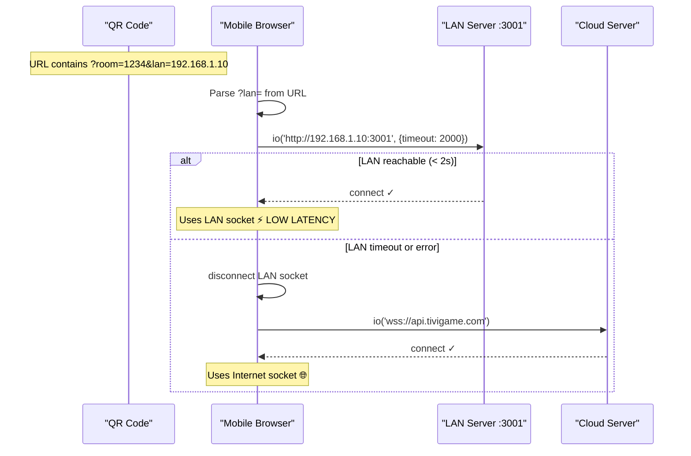

**Why LAN?**  
When TV and mobiles share the same Wi-Fi, LAN socket latency is **~1-5ms** vs **~50-200ms** over internet. Critical for game inputs (jumps, movements).

**How the LAN IP is discovered:**  
1. TV asks its own server: `GET /myip`
2. Server reflects the requesting IP back: `{ ip: "192.168.1.10" }`
3. TV embeds it into the QR code URL: `?lan=192.168.1.10`
4. Mobile reads `?lan=` on page load

---

## 3. Full Connection Lifecycle

### 3.1 Normal Flow — From Boot to Playing

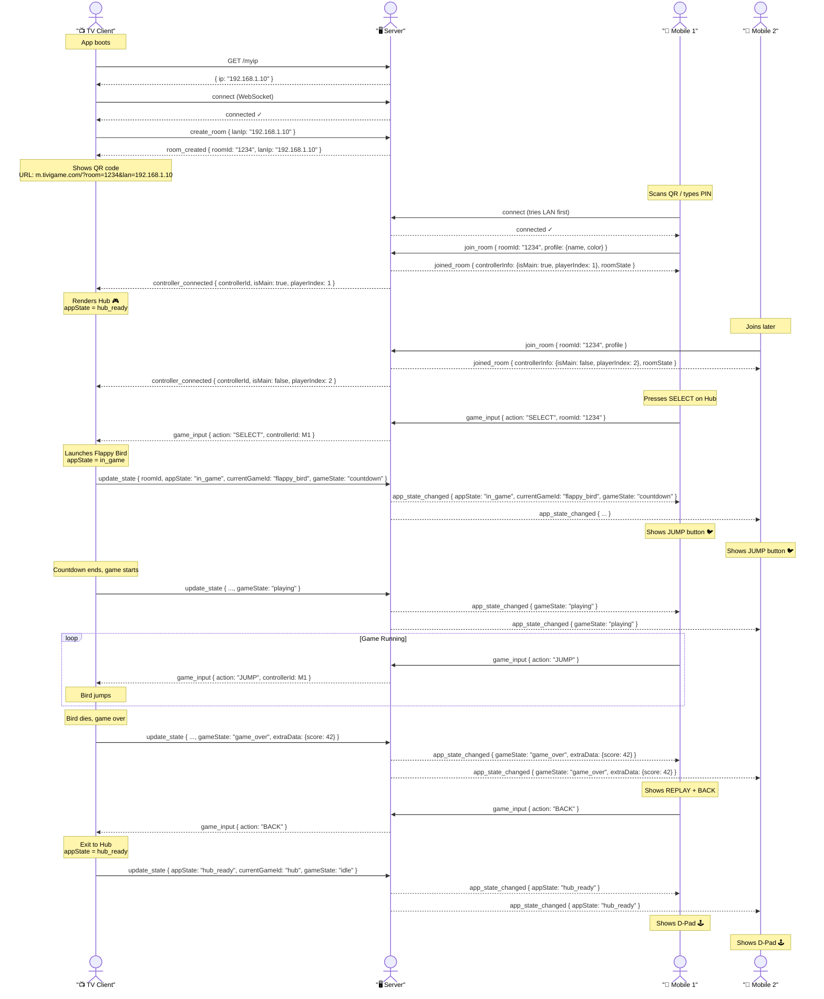

---

### 3.2 Reconnect Flow — Mobile Lost Connection

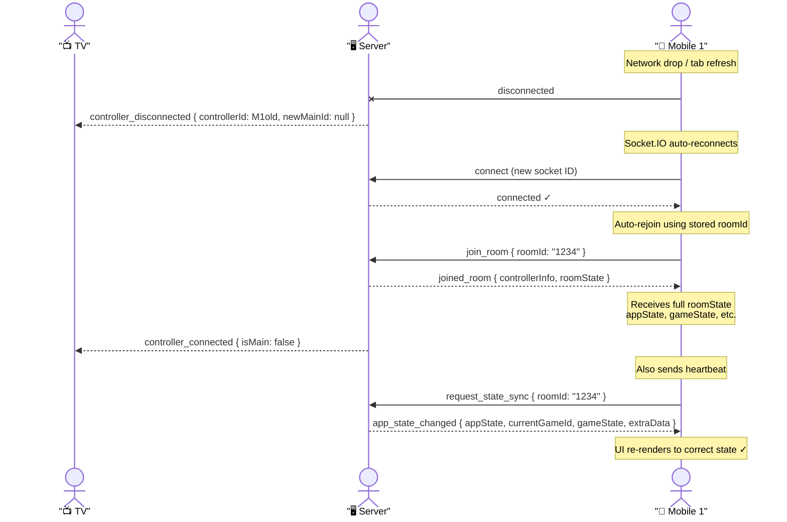

---

### 3.3 Disconnect Flow — All Mobiles Leave

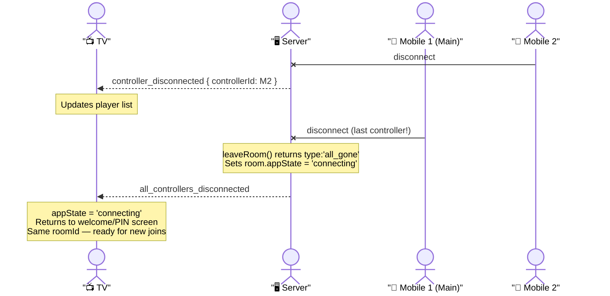

---

### 3.4 Disconnect Flow — TV (Host) Leaves

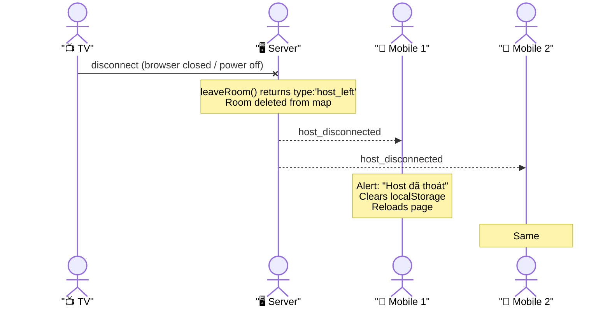

---

### 3.5 Main Controller Promotion

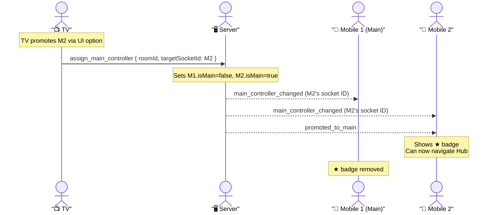

---

## 4. State Machine

### 4.1 Application State (`AppState`)

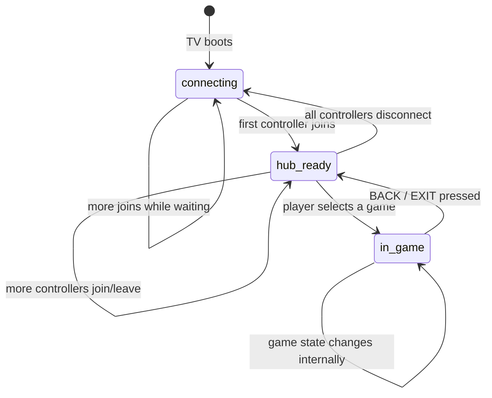

| State | TV shows | Mobile shows |
|:---|:---|:---|
| `connecting` | QR code + PIN | — (not yet joined) |
| `hub_ready` | Game selection grid | D-pad + SELECT |
| `in_game` | Active game canvas | Game-specific controller |

---

### 4.2 Game State (`GameState`)

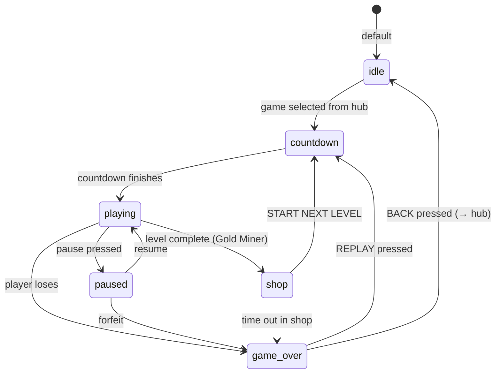

| State | Who controls transition | Mobile UI |
|:---|:---|:---|
| `idle` | TV (hub) | HubController |
| `countdown` | TV (game engine) | Game controller (inactive) |
| `playing` | TV (game engine) | Game controller (active) |
| `paused` | TV | Pause overlay |
| `game_over` | TV (game engine) | REPLAY + BACK buttons |
| `shop` | TV (Gold Miner) | Shop buttons |
| `mining` | TV (Gold Miner) | D-pad + DYNAMITE |

---

### 4.3 Mobile Controller UI Decision Tree

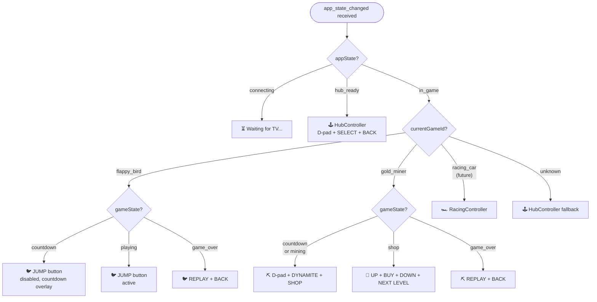

---

## 5. Complete Event Reference

### 5.1 TV → Server

| Event | Payload | When |
|:---|:---|:---|
| `create_room` | `{ lanIp: string }` | TV boots |
| `update_state` | `{ roomId, appState, currentGameId, gameState, extraData? }` | Any state change |
| `assign_main_controller` | `{ roomId, targetSocketId }` | TV promotes a controller |
| `get_highscore` | — | TV requests global high score |
| `update_highscore` | `{ score: number, playerName: string }` | Game ends with new record |

---

### 5.2 Mobile → Server

| Event | Payload | When |
|:---|:---|:---|
| `join_room` | `{ roomId, profile: { name, color } }` | Mobile joins a room |
| `game_input` | `{ action: string, roomId: string }` | Button press |
| `request_state_sync` | `{ roomId }` | Every 30s heartbeat + on reconnect |

**`action` values by game:**

| Context | Actions |
|:---|:---|
| Hub | `LEFT` `RIGHT` `UP` `DOWN` `SELECT` `BACK` |
| Flappy Bird | `JUMP` `BACK` `REPLAY` |
| Gold Miner (mining) | `LEFT` `RIGHT` `UP` `DOWN` `DYNAMITE` `BACK` |
| Gold Miner (shop) | `UP` `DOWN` `BUY` `START` `BACK` |
| Gold Miner (game over) | `REPLAY` `BACK` |

---

### 5.3 Server → TV

| Event | Payload | When |
|:---|:---|:---|
| `room_created` | `{ roomId: string, lanIp: string }` | After `create_room` |
| `controller_connected` | `{ controllerId, profile, isMain, playerIndex }` | Mobile joins |
| `controller_disconnected` | `{ controllerId, newMainId? }` | Mobile leaves (others remain) |
| `all_controllers_disconnected` | — | Last mobile leaves |
| `game_input` | `{ action, controllerId, roomId }` | Relayed from mobile |
| `highscore_data` | `{ score, playerName }` | Response to `get_highscore` |
| `highscore_updated` | `{ score, playerName }` | New global record set |

---

### 5.4 Server → All Mobiles in Room (Broadcast)

| Event | Payload | When |
|:---|:---|:---|
| `joined_room` | `{ controllerInfo, roomState }` | Sent only to the joining mobile |
| `app_state_changed` | `{ roomId, appState, currentGameId, gameState, extraData? }` | Any TV state change OR sync heartbeat response |
| `host_disconnected` | — | TV disconnects |
| `error_message` | `string` | Room not found / full |
| `main_controller_changed` | `string` (new main's socketId) | After promotion |

---

### 5.5 Server → Specific Mobile Only

| Event | Payload | When |
|:---|:---|:---|
| `joined_room` | `{ controllerInfo, roomState }` | Mobile that just joined |
| `promoted_to_main` | — | The newly promoted controller |
| `error_message` | `string` | Join failure |

---

## 6. Data Structures

### `RoomState` (stored on server, sent to mobile on join/sync)

```typescript
interface RoomState {
    roomId:        string;          // "1234"
    hostId:        string;          // TV's socket ID
    lanIp:         string;          // "192.168.1.10" or ""
    appState:      AppState;        // 'connecting' | 'hub_ready' | 'in_game'
    currentGameId: string;          // 'hub' | 'flappy_bird' | 'gold_miner'
    gameState:     GameState;       // 'idle' | 'playing' | 'game_over' | ...
    extraData:     Record<string, unknown>; // { score: 42, level: 3 }
    controllers:   ControllerInfo[];
}

interface ControllerInfo {
    socketId:    string;
    isMain:      boolean;
    playerIndex: number;   // 1-based
    profile:     { name: string; color: string };
}
```

### `StateChangePayload` (TV → Server → All Mobiles)

```typescript
interface StateChangePayload {
    roomId:        string;
    appState:      AppState;
    currentGameId: string;
    gameState:     GameState;
    extraData?:    Record<string, unknown>;
}
```

### `game_input` payload (Mobile → Server → TV)

```typescript
interface GameInputPayload {
    action:       string;    // "JUMP", "LEFT", "SELECT", etc.
    roomId:       string;
    controllerId: string;    // added by server before forwarding to TV
}
```

---

## 7. Heartbeat & State Sync

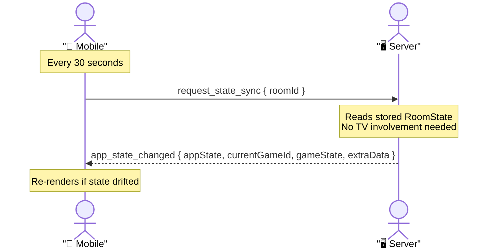

**Why 30s?** Balances freshness vs. server load. The heartbeat is a safety net — the primary sync happens via `app_state_changed` broadcasts. The heartbeat only matters when a broadcast was missed (network hiccup, tab sleep).

---

## 8. Server Room State Transitions

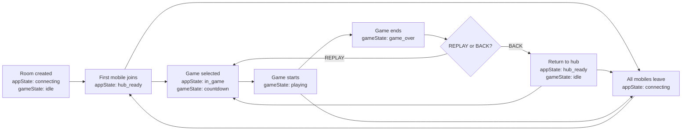

---

## 9. File Responsibility Map

```
┌─── SERVER ─────────────────────────────────────────────────────────────┐
│  index.js          — Socket event handlers, CORS, /myip endpoint       │
│  roomManager.js    — Room CRUD, state storage, controller tracking     │
│  constants.js      — SOCKET_EVENTS string constants                   │
└────────────────────────────────────────────────────────────────────────┘

┌─── TV CLIENT ──────────────────────────────────────────────────────────┐
│  main.ts           — Entry, socket init, hub render, game launch       │
│  socketManager.ts  — LAN IP detection, socket creation                 │
│  constants/        — SOCKET_EVENTS (typed)                             │
│  types/state.ts    — AppState, GameState, RoomState types             │
│  games/GameBase.ts — Abstract: emitState(), roomId, gameId            │
│  games/flappy_bird/— Phaser game, calls this.emitState()              │
│  games/gold_miner/ — Phaser game, calls this.emitState()              │
└────────────────────────────────────────────────────────────────────────┘

┌─── MOBILE CLIENT ──────────────────────────────────────────────────────┐
│  App.tsx           — State routing, socket listeners, header UI        │
│  hooks/useSocket.ts— LAN-first connection, reconnect, transport badge  │
│  constants/        — SOCKET_EVENTS (typed)                             │
│  types/state.ts    — AppState, GameState types                        │
│  controllers/      — HubController, FlappyController, GoldMiner...    │
│  controllers/index — resolveController(appState, gameId) registry      │
└────────────────────────────────────────────────────────────────────────┘
```

---

## 10. Quick Reference Cheatsheet

```
TV boots
  └─► GET /myip → get LAN IP
  └─► connect socket
  └─► emit create_room { lanIp }
  └─► on room_created → show QR (URL includes ?lan=)

Mobile scans QR
  └─► try ws://lanIp:3001 → 2s timeout → fallback wss://api.tivigame.com
  └─► emit join_room { roomId, profile }
  └─► on joined_room → set appState from roomState
  └─► every 30s: emit request_state_sync

TV gets controller_connected
  └─► update state.appState = 'hub_ready' (first mobile)
  └─► renderHub()

Mobile sends game_input
  └─► server relays to TV
  └─► TV handles: navigate hub OR forward to activeGame.handleInput()

TV launches game
  └─► state.appState = 'in_game'
  └─► emit update_state { appState:'in_game', gameId, gameState:'countdown' }
  └─► server stores state + broadcasts app_state_changed to ALL mobiles

Game ends
  └─► TV: this.emitState('game_over', { score })
  └─► Server broadcasts app_state_changed to all mobiles
  └─► Mobiles show REPLAY / BACK

Mobile presses BACK
  └─► emit game_input { action: 'BACK' }
  └─► TV: exitToHub() → emitState hubs state
  └─► All mobiles switch to HubController
```
